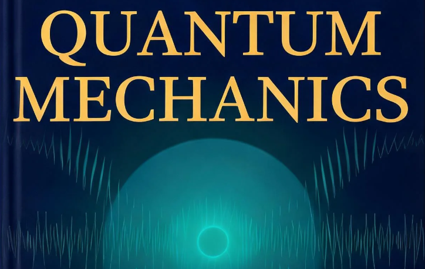

+++ { "kind": "split-image" }

## Welcome to Quantum Mechanics

<!-- An open-source knowledge database, interactive, neural network formation, with AI -->
<!--  -->

{button}`Get Started </book>`

+++ {"kind": "centered", "class": "col-body"}

## About Open Science

::::{grid} 1 2

We are building an open-science knowledge initiative at UC Berkeley BIDMaP. Our vision is a multilingual open knowledge infrastructure for STEM learning in the AI and LLM era. We aim to make scientific knowledge high-quality, authoritative, expert-edited, and freely accessible. This resource will be continuously updated for students, educators, and researchers worldwide. It is designed to benefit anyone, regardless of geography or educational resources. Using MOFs as an example, a learner will not only see individual topics but can also navigate across linked concepts. These include organic chemistry, characterization methods, and machine learning. Built on open-source tools from the Jupyter community, the platform offers textbook-style organization with interactive code, visualizations, downloadable notebooks, and LLM-based content support. It checks content accuracy, organizes frontier updates, and guides interpretation.

:::{figure} ./earth.png
:align: center
:::

::::

### Our Goals

Open Science is a public knowledge commons for the AI era: free to access, easy to improve, and built for learners everywhere.

::::{grid} 1 2 3 3
:class: home-goals-grid

:::{card} Open by Default
No paywalls, no fees, and no artificial barriers to scientific knowledge.
:::

:::{card} Built by Community
Transparent, open-source collaboration with expert review at the center.
:::

:::{card} Global and Multilingual
Resources designed for students, educators, and researchers across languages and regions.
:::

::::

Contribute knowledge, tools, and review. Build for science.

